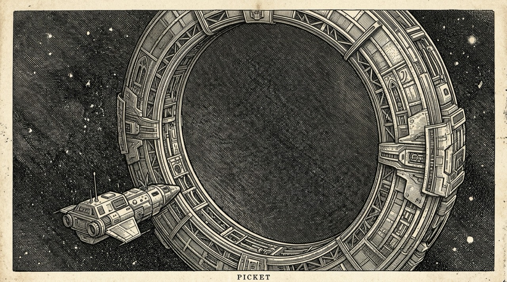
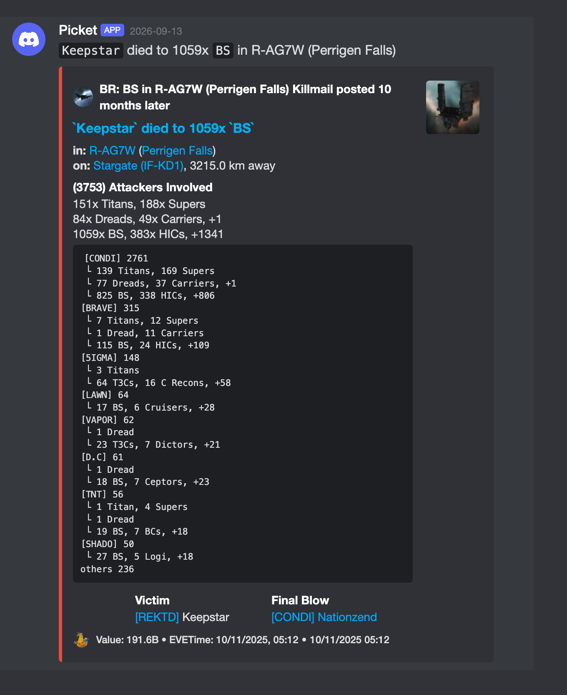
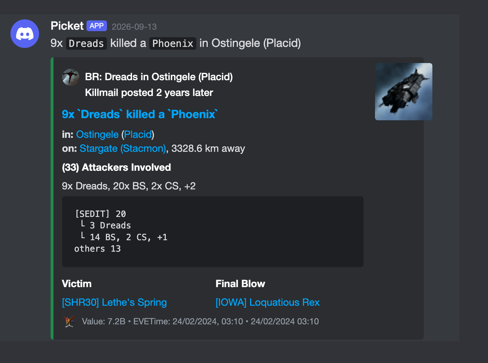
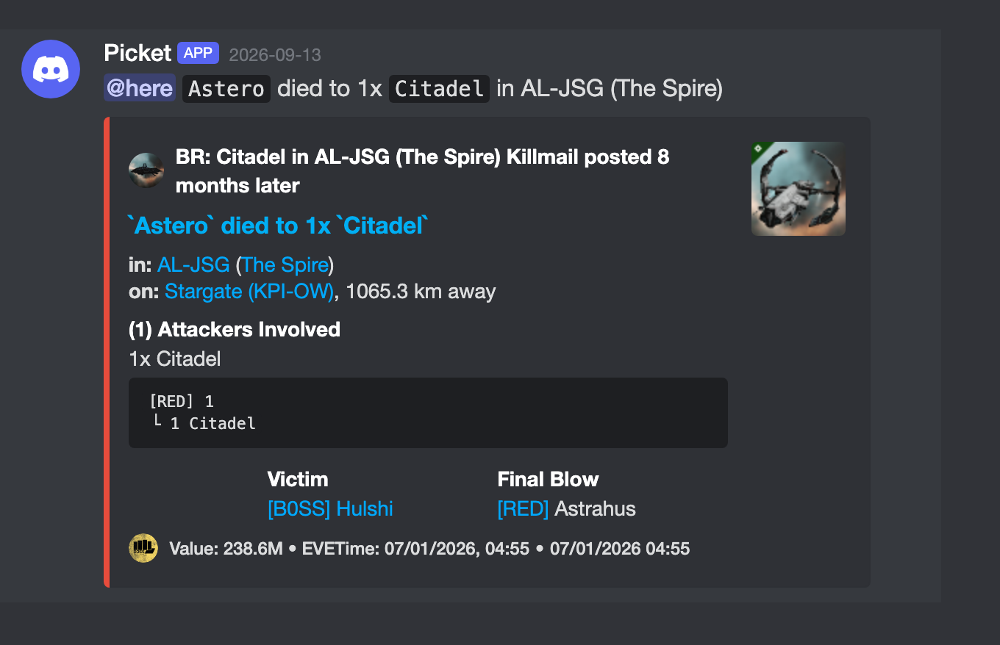
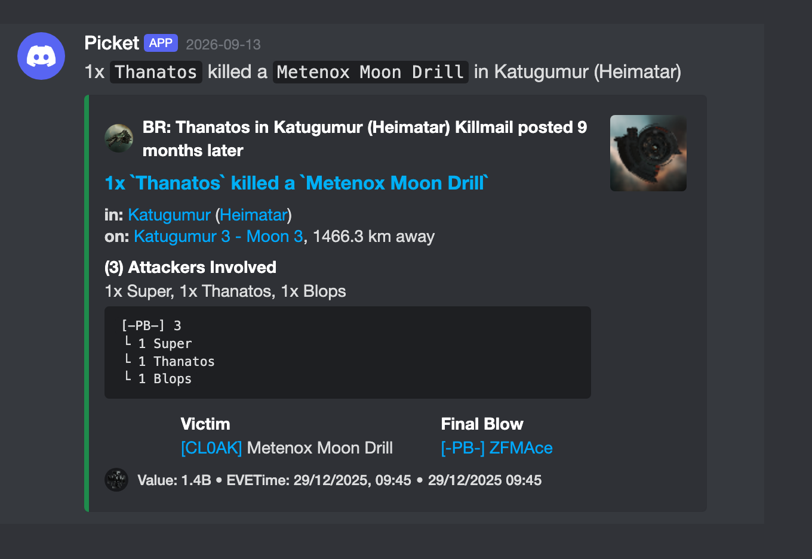

# Picket

Picket: EVE Online intel feeds for Discord.

[](https://www.rust-lang.org/)




Picket watches zKillboard killmails, ESI sov campaigns, public contracts, and corp or alliance rosters, and posts only what a channel's filters ask for.

The setup that gets used most: @here when a dread, carrier, FAX, or Rorqual lands on a killmail within a few light-years of your staging, @everyone when it's a super or titan, anyone you've set blue skipped, and no ping at all once the kill is more than five minutes old.

A picket is the ship you leave on a gate to call what comes through. That's the whole idea here. You say what counts as worth calling, per channel, and the bot holds the gate.

Picket is built and run by an EVE Online Partner. If it earns a place in your server, use creator code DRAC at eveonline.com/checkout.

<p align="center"></p>

| Loss (structure Subscription, victim side) | Kill (ship group Subscription, attacker side) |
| --- | --- |
|  |  |

| Radar ping (light-year range, @here) | Type-Tracked Ship (title names the hull) |
| --- | --- |
|  |  |

The screenshots are rendered from the bot's real message payloads (see `scripts/render-screenshots.mjs`), so they match what the bot sends; the Discord chrome around them is a faithful web component, not the client itself.

---

## Table of Contents

- [Usage](#usage)
- [Commands](#commands)
- [Advanced Examples](#advanced-examples)                                                                                                                                    
- [Manual Configuration](#manual-configuration)
- [Global Public Contract Intelligence](#global-public-contract-intelligence)
- [Sovereignty Timer Feed](#sovereignty-timer-feed)
- [Watchlist feed](#watchlist-feed)
- [Development](#development)
- [Contact](#contact)
- [License](#license)

## Usage

The primary way to use the bot is by inviting it to your Discord server and using slash commands to create and manage subscriptions.

### 1. Invite the Bot
Use the following link to add the bot to your server. The owner of the bot will need to replace `YOUR_CLIENT_ID` with their bot's actual client ID.

[**Invite Picket**](https://discordapp.com/api/oauth2/authorize?client_id=YOUR_CLIENT_ID&permissions=149504&scope=bot) 

### 2. Create a Subscription
In the channel where you want to receive killmails, use the `/subscribe` command. This command allows you to combine multiple filter options to create a specific alert. All specified filters are combined with an "AND" logic—the killmail must match **all** of them to be posted.

**Example:** To track kills involving Dreadnoughts (group ID 485) and Marauders (group ID 547) in the Devoid region (ID 10000030) that are worth at least 1 billion ISK, you would use:
```
/subscribe id: cap-watch-devoid description: Capital and Marauder kills in Devoid region_ids: 10000030 ship_group_ids: 485,547 min_value: 1000000000
```

When you create your first subscription in a server, the bot will automatically generate a configuration file named `[your_server_id].json` (e.g., `123456789012345678.json`) on the host machine. All subsequent subscriptions for that server will be managed through in-Discord commands.

## Commands

### `/subscribe`
Creates or updates a killmail subscription for the current channel. All filter options are optional except for `id` and `description`.

Both `/subscribe` and `/unsubscribe` require the Manage Server (`MANAGE_GUILD`) permission and cannot be used in DMs.

-   `id` (Required): A unique name for the subscription (e.g., `my-first-filter`).
-   `description` (Required): A brief explanation of what the subscription does.
-   `min_value`: Minimum total ISK value.
-   `max_value`: Maximum total ISK value.
-   `region_ids`: Comma-separated list of region IDs.
-   `system_ids`: Comma-separated list of system IDs.
-   `alliance_ids`: Comma-separated list of alliance IDs.
-   `corp_ids`: Comma-separated list of corporation IDs.
-   `char_ids`: Comma-separated list of character IDs.
-   `ship_type_ids`: Comma-separated list of ship type IDs.
-   `ship_group_ids`: Comma-separated list of ship group IDs.
-   `security`: A security status range (e.g., `"-1.0..=0.4"` for low/nullsec).                                                                                              
-   `is_npc`: `True` for NPC-only kills, `False` for player-only.
-   `is_solo`: `True` for solo kills only.
-   `min_pilots`: Minimum number of pilots involved.
-   `max_pilots`: Maximum number of pilots involved.
-   `name_fragment`: A string that must appear in the ship's name.
-   `time_range_start` / `time_range_end`: A UTC hour range (0-23) for the kill.
-   `ly_ranges_json`: A JSON string for system ranges (e.g., `'[{"system_id":30000142, "range":10.0}]'`).
-   `ping_type`: Ping `@here` or `@everyone` for a match. Do not set this together with `role`.
-   `role`: Select one Discord role to ping for a match. This is a native Discord role selector; do not enter a role name or mention string. Do not set this together with `ping_type`.
-   `max_ping_delay_minutes`: The maximum age of a killmail (in minutes) to be eligible for a ping. Omit it, or set it to `0`, to allow pings for any killmail age. Stale matches are still posted without a ping.
-   `ping_cooldown_minutes`: The minimum time between pings in the current channel. It applies to `@here`, `@everyone`, and role pings. Omit it to use the five-minute default; a cooldown-suppressed match is still posted without a ping.

The cooldown is shared by every subscription in the same channel, but each channel has its own timer. Role pings mention only the selected role. The bot must be allowed to mention that role: make the role mentionable, or grant the bot Discord's `MENTION_EVERYONE` permission. See Discord's [allowed mentions documentation](https://docs.discord.com/developers/resources/message#allowed-mentions-object) for the permission behavior.

### `/unsubscribe`
Removes a subscription from the current channel.
-   `id` (Required): The unique ID of the subscription to remove.

### Contract commands

Contract subscriptions are PostgreSQL-backed and are separate from killmail subscriptions. Run these commands in the channel that should receive the contract feed.

| Command | Required arguments | Optional arguments | Result |
| --- | --- | --- | --- |
| `/contract_subscribe` | `id`, `description`, `filter`, `event_actions` | `ly_ranges_json`, `ping_type` | Creates or replaces this channel's public-contract subscription with the same `id`. |
| `/contract_unsubscribe` | `id` | None | Removes this channel's contract subscription with that `id`. |

Both `/contract_subscribe` and `/contract_unsubscribe` require the Manage Server (`MANAGE_GUILD`) permission and cannot be used in DMs; server admins can loosen this per role under Server Settings → Integrations → the bot → Command permissions. The [sov and watchlist runbook](docs/sov-and-watchlist-feeds.md#permissions) collects the full gated-command list and the same loosening steps.

`filter` is JSON with one `root` node. Nodes are `condition`, `and`, `or`, and `not`; the examples below use the deployed syntax. `event_actions` is JSON keyed by `listed`, `sale_confirmed`, `purchase_confirmed`, `expired`, and `closed_outcome_unknown`. Each value is `ignore`, `post`, or `post_and_ping`; omitted actions default to `ignore`.

`ly_ranges_json` is a non-empty array of system ranges, such as `[{"system_id":30002086,"range":8.0}]`. It is combined with `filter` using `AND`; multiple systems are alternatives. `ping_type:here` sends `@here` for every `post_and_ping` action in the subscription, while `ping_type:everyone` sends `@everyone`.

### `/diag`
Displays diagnostic information for all subscriptions active in the current channel.

### Finding IDs
To find the correct IDs for regions, systems, ships, and groups, you can use a third-party database site like [**EVE Ref**](https://everef.net/type) or Dotlan. For character, corporation, and alliance IDs, zKillboard is an excellent resource.

## Advanced Examples                                                                                                                                                         
                                                                                                                                                                             
### Pinging for Capital Kills Near a Staging System                                                                                                                       
                                                                                                                                                                             
This example creates a subscription that pings `@everyone` if a killmail involving Capital ships occurs within 7.0 light-years of Turnur (system ID 30002086). The              
ping will only be sent if the killmail is less than 10 minutes old.                                                                                                          
                                                                                                                                                                             
```                                                                                                                                                                          
/subscribe id: capitals-radar description: Capitals near Turnur ship_group_ids: 485 ly_ranges_json: [{"system_id":30002086, "range":7.0}] ping_type: Everyone
max_ping_delay_minutes: 10
```                                                                                                                                                                          
                                                                                                                                                                             
### Monitoring Nullsec for Specific Alliances                                                                                                                                
                                                                                                                                                                             
This example tracks activity in nullsec (`-1.0` to `0.0`) involving either Pandemic Horde (alliance ID 498125261) or Goonswarm Federation (alliance ID                   
1354830081) in the Curse (region ID 10000012) region.
                                                                                                                                                                             
```                                                                                                                                                                          
/subscribe id: nullsec-blocs description: Horde vs. Goons activity in nullsec security: "-1.0..=0.0" alliance_ids: 498125261,1354830081 region_ids: 10000012
```                                                                                                                                                                          


## Manual Configuration

For advanced users or for migrating configurations, you can manually edit the JSON files located in the `config/` directory. The bot automatically creates a file named `[guild_id].json` for each server where a subscription is made.

### Example `[guild_id].json`
This JSON structure is equivalent to the example `/subscribe` command shown above in step 2 of the usage guide.

```json
[
  {
    "id": "cap-watch-devoid",
    "description": "Capital and Marauder kills in Devoid",
    "action": {
      "channel_id": "YOUR_DISCORD_CHANNEL_ID"
    },
    "filter": {
      "And": [
        { "Condition": { "Region": [ 10000030 ] } },
        { "Condition": { "ShipGroup": [ 485, 547 ] } },
        { "Condition": { "TotalValue": { "min": 1000000000 } } }
      ]
    }
  }
]
```

## Global Public Contract Intelligence

The contract feed follows the same category model as the kill feeds: global feeds watch the configured class everywhere, and the Turnur/Kurniainen feed watches the configured class within range. It is an optional PostgreSQL-backed feed and does not migrate or replace the JSON-backed killmail configuration.

### What contract feeds monitor

These feeds do not show every contract listing. They monitor public `item_exchange` contracts whose offered or requested ship items match the configured ship groups, lifecycle action, and, where configured, location and light-year range. The source is the public [EVE Swagger Interface (ESI)](https://developers.eveonline.com/docs/services/esi/overview/).

They do not monitor private personal, corporation, or alliance contracts, or contract types other than public item exchanges. The collector scans the 114 region IDs returned by ESI and does not exclude wormhole regions. Public ESI does not provide a counterparty for these records, so the feed does not infer or display one.

The lifecycle actions are:

| Action | Meaning |
| --- | --- |
| `listed` | A matching public contract was observed. |
| `sale_confirmed` | Acceptance of an offered-item contract was confirmed with public ESI evidence. |
| `purchase_confirmed` | Acceptance of a requested-item contract was confirmed with public ESI evidence. |
| `expired` | The contract expired without confirmed acceptance evidence. |
| `closed_outcome_unknown` | The contract is no longer public, but the collector could not confirm why it closed. |

`sale_confirmed` and `purchase_confirmed` are not sent just because a listing disappears. The collector requires acceptance evidence. A `closed_outcome_unknown` post only says that the listing stopped being public.

### Live feed configurations

The following are the three active feeds. The JSON is the current deployed configuration, formatted for direct slash-command use.

#### Global supercaps

Posts all lifecycle actions for public titan and supercarrier contracts in every ESI region the collector scans. It does not ping.

```text
/contract_subscribe id:supercap-global description:Global public titan and supercarrier contracts filter:{"root":{"and":[{"condition":{"event_kinds":["listed","sale_confirmed","purchase_confirmed","expired","closed_outcome_unknown"]}},{"or":[{"condition":{"ship_groups":{"ids":[30,659],"direction":"offered"}}},{"condition":{"ship_groups":{"ids":[30,659],"direction":"requested"}}}]}]}} event_actions:{"listed":"post","sale_confirmed":"post","purchase_confirmed":"post","expired":"post","closed_outcome_unknown":"post"}
```

#### Global capitals

Posts all lifecycle actions for public contracts containing the configured capital ship groups in every ESI region the collector scans. It does not ping.

```text
/contract_subscribe id:capital-global description:Global public capital contracts filter:{"root":{"and":[{"condition":{"event_kinds":["listed","sale_confirmed","purchase_confirmed","expired","closed_outcome_unknown"]}},{"or":[{"condition":{"ship_groups":{"ids":[4594,485,1538,547,883,902,513],"direction":"offered"}}},{"condition":{"ship_groups":{"ids":[4594,485,1538,547,883,902,513],"direction":"requested"}}}]}]}} event_actions:{"listed":"post","sale_confirmed":"post","purchase_confirmed":"post","expired":"post","closed_outcome_unknown":"post"}
```

#### Supercaps within 8 LY of Turnur or Kurniainen

Posts the same lifecycle actions for public titan and supercarrier contracts within 8 LY of Turnur (30002086) or Kurniainen (30003089). Only confirmed sale and purchase actions ping `@here`.

```text
/contract_subscribe id:supercap-turnur-kurniainen-8ly description:Public supercapital contracts within 8 ly of Turnur or Kurniainen filter:{"root":{"and":[{"condition":{"event_kinds":["listed","sale_confirmed","purchase_confirmed","expired","closed_outcome_unknown"]}},{"or":[{"condition":{"ship_groups":{"ids":[30,659],"direction":"offered"}}},{"condition":{"ship_groups":{"ids":[30,659],"direction":"requested"}}}]}]}} event_actions:{"listed":"post","sale_confirmed":"post_and_ping","purchase_confirmed":"post_and_ping","expired":"post","closed_outcome_unknown":"post"} ly_ranges_json:[{"system_id":30002086,"range":8.0},{"system_id":30003089,"range":8.0}] ping_type:here
```

Use `/contract_unsubscribe id:<id>` in that feed's channel to stop one of these feeds. See [the operator runbook](docs/contract-intelligence.md) for the complete filter grammar and operations details.

## Sovereignty Timer Feed

The sov timer feed watches public sovereignty campaigns and posts to subscribed channels when one appears, when a configured T-minus mark is reached, and computes whether the campaign's system is reachable from a home system (Turnur by default) over stargates and, optionally, the current Wanderer wormhole chain. It also watches Sovereignty Hub vulnerability windows and alerts when one shifts into a subscription's preferred timezone. It shares the contract feed's PostgreSQL database and only starts when `CONTRACT_DATABASE_URL` is configured. Subscriptions use `/sov_subscribe` (with `max_jumps`, 1-11, `allow_frigate_holes`, `tz_window`, and `tz_shift_enabled` convenience options) and `/sov_unsubscribe`; `/sov_timers` lists the live campaigns matching a channel's subscriptions on demand.

`/sov_subscribe` and `/sov_unsubscribe` require the Manage Server (`MANAGE_GUILD`) permission and cannot be used in DMs, while `/sov_timers` stays open to every member.

| Command | Required arguments | Optional arguments | Result |
| --- | --- | --- | --- |
| `/sov_subscribe` | `name` | `filter`, `region_id`, `defender_alliance_id`, `max_jumps` (1-11), `allow_frigate_holes`, `role`, `user`, `tminus_marks`, `tz_window`, `tz_shift_enabled`, `clear` | Creates a sov subscription, or partially updates the existing one with that `name` in this channel (omitted fields are carried forward; see the partial-update note below). |
| `/sov_unsubscribe` | `name` | None | Removes this channel's sov subscription with that `name`. |
| `/sov_timers` | None | None | Lists the live sov campaigns matching this channel's subscriptions on demand. |

`name` is the stable per-channel subscription name. `filter` is required to create a brand-new subscription (or at least one convenience option), and is optional on a re-subscribe. `region_id`, `defender_alliance_id`, `max_jumps`, and `allow_frigate_holes` are convenience options ANDed onto the filter root; `allow_frigate_holes` requires `max_jumps`. `tminus_marks` (default `120,30`), `tz_window` (default `00:00-04:00`), and `tz_shift_enabled` (default `false`) are behavioural options. `clear` removes stored fields. See the [operator runbook](docs/sov-and-watchlist-feeds.md) for the walkthrough and operations, and the option details below.

Reachability is computed by breadth-first search over `config/stargates.json`, a static undirected stargate adjacency map generated from the SDE `mapSolarSystemJumps` table and committed to the repository. The home system defaults to Turnur (30002086) and is overridden with `SOV_HOME_SYSTEM_ID`. If the file is missing or fails to parse, the bot logs an error and keeps running: `Reachable` filter leaves never match and `/sov_timers` reports the graph as unavailable, rather than the process failing to start.

### Wanderer chain reachability

When `WANDERER_BASE_URL`, `WANDERER_MAP`, and `WANDERER_MAP_API_KEY` are all set, the bot additionally polls the alliance's Wanderer map every two minutes (read-only: the client type has no write methods, even though the map API key itself is write-capable on Wanderer's side) and merges the current chain's traversable connections into the same stargate graph, so a campaign beyond gate range becomes reachable when the chain opens a door to it. Two routes are cached per chain snapshot -- with and without frigate-sized holes -- selected by the `Reachable` leaf's `allow_frigate_holes` flag. Critical-mass holes never traverse; every end-of-life bucket traverses (it is a risk fact, not a filter); gate/bridge connections tracked on the map traverse as one jump. When the route crosses at least one wormhole, the alert embed and `/sov_timers` show a Path Risk line (`worst hole: EOL <4h, mass <50%`); a pure gate route shows no such line. On a Wanderer error the last good snapshot keeps serving reachability; it is reported stale after ten minutes with no successful fetch (surfaced in `/sov_timers` as `chain: stale since <t>`, or `chain: not configured` when the three variables above are not all set), and in the Runtime Health Snapshot as `sov_chain_progress`. Any of the three variables missing simply keeps reachability stargate-only, exactly as before this feature existed.

### Sov timer subscription filter grammar

`/sov_subscribe filter:` accepts one JSON document: `{"root": <node>}`. A node is `{"condition": <leaf>}`, `{"and": [<node>, ...]}`, `{"or": [<node>, ...]}`, or `{"not": <node>}`. Leaf tag names are the `SovFilterCondition` variants exactly as serialized in `src/sov_feed/model.rs` (`#[serde(rename_all = "snake_case")]`):

| Leaf tag | Shape | Bounds |
| --- | --- | --- |
| `vulnerable_within` | `{"hours": N}` | 1-720 (30 days) |
| `defender` | `{"alliance_ids": [N, ...], "watchlist": bool}` | both fields optional but at least one must select something: a non-empty list of positive alliance IDs and/or `"watchlist": true`. `"watchlist": true` additionally matches every alliance on the subscribing server's watchlist (see "Watchlist feed" below), resolved at evaluation time, so the leaf follows `/watch add`/`/watch remove` without re-subscribing |
| `region` | `[N, ...]` | non-empty, positive region IDs |
| `system` | `[N, ...]` | non-empty, positive system IDs |
| `event_type` | `["tcu_defense" \| "ihub_defense" \| "station_defense" \| "station_freeport", ...]` | non-empty |
| `reachable` | `{"max_jumps": N, "allow_frigate_holes": bool}` | `max_jumps` 1-11; `allow_frigate_holes` defaults to `false` and, when `true`, admits frigate-sized wormhole connections on the Wanderer chain route |

Two complete examples (pinned by a round-trip unit test in `src/sov_feed/model.rs`, `readme_sov_subscribe_filter_examples_round_trip`):

Defense events starting within 12h in a system reachable within 8 jumps, including frigate-sized holes on the chain:

```text
{"root":{"and":[{"condition":{"vulnerable_within":{"hours":12}}},{"condition":{"reachable":{"max_jumps":8,"allow_frigate_holes":true}}}]}}
```

Campaigns in Jita that are not station freeports:

```text
{"root":{"and":[{"condition":{"system":[30000142]}},{"not":{"condition":{"event_type":["station_freeport"]}}}]}}
```

Campaigns defended by any alliance on this server's watchlist:

```text
{"root":{"condition":{"defender":{"watchlist":true}}}}
```

`/sov_subscribe` also takes convenience options instead of hand-writing the equivalent leaf: `region_id`, `defender_alliance_id`, `max_jumps`, and `allow_frigate_holes` (requires `max_jumps` also be set) are each ANDed onto the `filter` root as an extra `region`/`defender`/`reachable` leaf when supplied. `tminus_marks` is a separate per-subscription option (comma-separated T-minus minutes; default 120,30), not a filter leaf. `tz_window` (`HH:MM-HH:MM`, EVE/UTC, default `00:00-04:00`, may cross midnight) and `tz_shift_enabled` (boolean, default `false`) are likewise plain options, not filter leaves; see "Vulnerability window shift alerts" below.

`role` pings a Discord role and `user` pings a specific Discord user; you can set either, both, or neither. Both are native Discord selectors (not names or mention strings). The alert's message content leads with the configured mentions followed by a plain-language summary line (a phone-banner) and `allowed_mentions` lists exactly the configured role/user ids, so only those ping. The embed itself is dense: a plain-language title of what happened, an author line naming why it matched, the defender alliance logo as the thumbnail, Discord-native timestamps for every time, and an EVE-time footer.

Re-running `/sov_subscribe` with an existing `name` in the same channel is a partial update, not a full replacement: every optional top-level field you omit is carried forward from the stored subscription, and any field you supply replaces the stored value. This applies to the ping `role`, the direct-ping `user`, the `region_id`/`defender_alliance_id`/`max_jumps`/`allow_frigate_holes` convenience options, and the `filter` itself — omitting `filter` keeps the previously typed filter, so `/sov_subscribe name:X max_jumps:6` adjusts only the reachability leaf while leaving the rest of the filter, the ping role, and the other convenience options untouched. Behind the scenes the stored filter is recomposed each time from your last explicit filter and the effective convenience values, so the convenience leaves never accumulate duplicates. `filter` is therefore optional on a re-subscribe (a brand-new subscription still needs a `filter`, or at least one convenience option, to have something to match). To remove a previously set field rather than keep it, list it in the `clear` option as a comma-separated set of field names — `role`, `user`, `region_id`, `defender_alliance_id`, `max_jumps`, `allow_frigate_holes` — for example `clear:role,max_jumps`. Supplying a field and naming it in `clear` in the same command is rejected, as is an unknown `clear` name. Naming a field in `clear` that has no stored value is a no-op — it is not reported as cleared, and doing so on a brand-new subscription is not an error. The ephemeral reply states which fields were replaced, preserved, and cleared.

One-time note for subscriptions created before this partial-update behaviour existed: such a "legacy" subscription has no recorded explicit filter, so its whole stored filter is treated as the base. Changing a convenience option (`region_id`, `defender_alliance_id`, `max_jumps`, `allow_frigate_holes`) on a legacy subscription therefore requires re-typing the `filter` in the same command (otherwise the change is rejected, and the subscription is left unchanged); once you do, the explicit filter and convenience values are recorded and every later partial update works without re-typing. Only re-typing the `filter` records this provenance: changing just the ping `role` or a behavioural option (`tminus_marks`, `tz_window`, `tz_shift_enabled`) on a legacy subscription needs no re-type and leaves it legacy, so the re-type requirement still guards a later convenience change.

### Vulnerability window shift alerts

Every five minutes (the route's own cache age) the bot polls `GET /sovereignty/structures/` and persists Sovereignty Hubs only -- legacy TCUs, which have not been entosisable since Equinox, are filtered out at collection time by `structure_type_id`. Hourly, it polls `GET /sovereignty/map/` and replaces the current system-ownership table wholesale; from this feed on, every sov alert embed (`appeared`, `tminus`, `reachable`, and `tz_window_entered` alike) shows a "System Owner" field resolved from that map (alliance ticker, corporation ticker, or faction name, in that order; omitted when the map has not loaded the system yet).

For a subscription with `tz_shift_enabled:true`, the `tz_window_entered` Alert Stage fires when a watched hub's `vulnerable_start_time..vulnerable_end_time` overlaps the subscription's `tz_window` by at least sixty minutes and the previously observed state for that hub and subscription was not in window; `Reachable` and `VulnerableWithin` filter leaves are ignored for this stage (treated as always matching), `EventType` does not apply to a structure (also treated as matching), and `Defender`, `Region`, and `System` leaves gate the alert normally. A hub whose vulnerability window is null or absent is never in window. Hubs present in the first successful structures cycle establish their in-window state silently (Sov Baseline), exactly like the reachability transition state added in an earlier ticket; leaving and re-entering the window fires again with a fresh stage key (`tz_window_entered:<n>`). The embed's footer reads `vuln window entered <window>` using the subscription's own window, not the hub's vulnerability window.

### Watchlist feed

Each server keeps a watchlist of alliances and corporations and receives an embed whenever a corporation joins or leaves a watched alliance, a watched entity's member count swings sharply, a watched corporation changes alliance, or a war is declared by or against a watched entity (and as that war gains allies, is retracted, or ends). It shares the contract feed's PostgreSQL database and only starts when `CONTRACT_DATABASE_URL` is configured.

`/watch` (all subcommands, including `list`), `/watch_subscribe`, and `/watch_unsubscribe` require the Manage Server (`MANAGE_GUILD`) permission and cannot be used in DMs.

| Command | Required arguments | Optional arguments | Result |
| --- | --- | --- | --- |
| `/watch add` | `kind` (`alliance` or `corporation`), `ticker` | None | Adds an alliance or corporation to this server's watchlist. |
| `/watch remove` | `kind` (`alliance` or `corporation`), `ticker` | None | Removes an alliance or corporation from this server's watchlist. |
| `/watch list` | None | None | Lists the watched alliances and corporations. |
| `/watch_subscribe` | `name` | `event_kinds`, `role`, `user` | Subscribes this channel to watchlist alerts (defaults to the four membership kinds; wars are opt-in). |
| `/watch_unsubscribe` | `name` | None | Removes this channel's watchlist subscription with that `name`. |

See the [operator runbook](docs/sov-and-watchlist-feeds.md) for the enable-and-verify walkthrough, retention, and day-to-day operation.

- `/watch add kind:<alliance|corporation> ticker:<text>` adds an entity. The `ticker` option is resolved through the bot's ticker cache first, then an ESI name lookup (`POST /universe/ids/`). Note ESI's ids endpoint resolves *names*, not tickers, so a bare ticker only works when it is already in the bot's cache; otherwise supply the full alliance/corporation name. For example, seed the five pilot alliances by full name: Snuffed Out, Shadow Cartel, Minmatar Fleet Alliance, Brotherhood of Spacers, and Legion of xXDEATHXx. The reply confirms the resolved name and id ephemerally. Adding the same entity twice is idempotent.
- `/watch remove kind:<...> ticker:<...>` removes an entity; `/watch list` shows the current watchlist.
- `/watch_subscribe name:<...> event_kinds:<comma list>` subscribes the current channel. `event_kinds` defaults to the **four membership kinds** (`corp_joined`, `corp_left`, `member_delta`, `corp_changed_alliance`); **wars are opt-in** — name a war kind explicitly (`war_declared`, `war_ally_joined`, `war_retracted`, `war_finished`) or pass the keyword `all` to select every kind including the war kinds. It takes an optional `role` and an optional `user` to ping (either, both, or neither): the alert's message content leads with those mentions followed by a plain-language summary line, and `allowed_mentions` lists exactly those ids. Unlike `/sov_subscribe`, `/watch_subscribe` replaces the subscription wholesale on every invocation, so `role`/`user` are re-supplied each time (omitting one clears it). `/watch_unsubscribe name:<...>` removes a channel subscription.

An hourly collector fetches each watched alliance's corporation list (`GET /alliances/{id}/corporations/`) with conditional requests through the shared ESI limiter and diffs it against the last snapshot. The first successful snapshot per alliance is a silent baseline (adding an alliance does not announce all its existing corporations); after that, a corporation appearing produces `corp_joined` and one disappearing produces `corp_left`, each delivered once per subscription with the alliance and corporation names/tickers, the event, and Dotlan/zKillboard links. Sov subscriptions can reference the watchlist as their defender filter with `{"defender": {"watchlist": true}}` (see the filter grammar above).

The same collector also fetches public corporation info (`GET /corporations/{id}/`) for every watched corporation and every current member corporation of each watched alliance, persisting timestamped member-count snapshots:

- **`member_delta`** — a watched entity's member count moving at least **10 %** in either direction against the snapshot **nearest seven days ago** (an alliance's count is the sum over its current member corporations' latest snapshots; a corporation's is direct). It requires roughly 6.5 days of history before it can fire, so a freshly added entity stays silent until it has a week of data. It fires **once per band crossing** and **re-arms only after the count returns inside the ±10 % band**, so a slowly shrinking alliance does not alert every hour. The embed shows the before/after counts, the percentage, the direction, and the reference window.
- **`corp_changed_alliance`** — a watched corporation whose current alliance differs from its previous snapshot (including joining or leaving an alliance entirely). It fires once per change and shows the old → new alliance names/tickers (`none` when unaffiliated). The first snapshot per corporation is a silent baseline.

Cost note: the corporation-info pass is one conditional request per corporation per hour, so a watched alliance of 150 corporations is ~150 requests per hour. It is bounded to at most 200 corporation-info fetches per cycle (least-recently-fetched first, the rest deferred to later cycles) and pauses on the shared ESI limiter, and the route's one-hour cache means most re-polls are cheap `304`s. Snapshots older than 30 days are pruned each cycle.

The same collector also tracks wars each hour (the wars route's cache age):

- **`war_declared`** — a war first seen above the high-water mark (the highest war id scanned) whose aggressor, defender, or any ally is a watched alliance or corporation. The embed shows the war id (with a [zKillboard war link](https://zkillboard.com/war/)), the aggressor and defender names/tickers, the `mutual` and `open_for_allies` flags, and the declared/started timestamps. `war_declared` fires only the cycle a war is first seen: a war stored before its party was watched (e.g. you add an entity later) is treated as a **silent war baseline** for that entity — no retroactive `war_declared` — but its ally joins, retraction, and finish are tracked from then on.
- **`war_ally_joined`** — a new ally appearing in a stored watched war on a re-fetch (fires once per ally).
- **`war_retracted`** / **`war_finished`** — the war's `retracted` / `finished` timestamp becoming set (each fires once). A war first seen already retracted or finished is announced only as `war_declared`.

The head-scan reads the id-descending war list (`GET /wars/`, at most 2000 ids per page, `?max_war_id=` to page older) above the high-water mark and fetches details (`GET /wars/{id}/`) for each new id. **Every** inspected war is stored (not only the watched ones), and "watched" is derived at query time — a war is watched iff any of its parties matches a watched entity of the same kind, in any guild. That way an entity added after a war was stored starts re-fetching that war's open wars on the next cycle, while an entity that is unwatched simply drops out of the re-fetch set. Each currently-watched open war (`finished` still null) is re-fetched every cycle (bounded, least-recently-fetched, at most 200 per cycle). Finished wars older than 30 days and below the head mark are pruned, so the table stays bounded to the open-war population plus recently-finished wars.

The first scan is a **silent baseline** that inspects every id that existed on the newest page when it began (wars already open are stored without posting). Because the page holds up to 2000 ids but each cycle fetches at most 200 details, the baseline spans several cycles. The first cycle reads the head to pin the head max and the page's bottom id (its floor); every later cycle then pages strictly **downward** from a persisted cursor (`?max_war_id=cursor`) rather than re-reading the head — the head drifts every hour as new wars are declared and push the oldest ids out of the 2000-id window, so an id that was on the original page but rolls off the head before the cursor reaches it is still reachable below the cursor. Ids **below the original window** (the floor) were never on the starting page and are out of scope by design. The baseline never completes on a limiter pause or an error, and wars declared while it is still running (ids above the pinned head max) are picked up — and posted as `war_declared` — by the first scan after it finishes. A war id whose detail cannot be fetched no longer freezes the mark forever: a `404` is a permanent absence and is skipped immediately (the mark advances past it), and any other error is skipped after three consecutive failed cycles. On the open-war re-fetch, a stored war that starts returning `404` (deleted by CCP) is marked gone so it drops out of the re-fetch set, and a transient error still rotates the war to the back of the least-recently-fetched order so it retries after the other open wars instead of re-selecting first every cycle.

All requests are conditional and go through the shared ESI limiter; the wars routes report `x-ratelimit-group: killmail` — the same per-route bucket as killmail detail fetches — whose remaining/reset is recorded in the shared limiter row that the health snapshot surfaces.

### Refreshing the stargate graph

Stargates essentially never move, so this only needs to run again after a rare SDE release that changes the map (e.g. a new region, a Pochven-style restructuring):

```shell
cargo run --bin build_stargate_graph
```

This fetches the [Fuzzwork SDE dump index page](https://www.fuzzwork.co.uk/dump/latest/) (to discover an SDE version stamp) and `mapSolarSystemJumps.csv` from the same mirror -- no other files -- then overwrites `config/stargates.json` with the parsed adjacency plus `sde_version` (the discovered stamp, or `unknown` if none was found), `source_last_modified` (the CSV response's `Last-Modified` header), `generated_at` (this run's timestamp), and the resulting `system_count`/`edge_count`. Review the diff -- `system_count`/`edge_count` should move by at most a handful of systems for an ordinary release -- and commit it like any other generated config file (`config/systems.json`, `config/ships.json`, ...).

## Development

This application is written in Rust and containerized using Docker.

### Requirements:

-   Docker
-   Docker Compose

### Setup:

1.  Clone this repository.
2.  Copy `docs/env.sample` to `.env` and add your Discord bot token and client ID.
3.  Run `docker-compose up --build -d` to start the application.

For the optional authenticated Contract Intelligence structure resolver, run `ENV_FILE=.env scripts/structure-resolver-provision.sh`. It performs dedicated-character consent, validates the returned authorization, probes known structures, and writes only the required runtime variables; see the [operator runbook](docs/contract-intelligence.md#optional-structure-resolver).

#### Example `.env` file

```shell
DISCORD_BOT_TOKEN=your_discord_bot_token
DISCORD_CLIENT_ID=your_discord_client_id
```

## Contact

Picket is a derivative of [hazardous-killbot](https://github.com/SvenBrnn/hazardous-killbot).

For any inquiries, please contact the developer at [this public email address](mailto:wands.larch.0y@icloud.com?subject=[GitHub]).

## License

This project is licensed under the MIT License. See the [LICENSE.md](LICENSE.md) file for details.

"EVE", "EVE Online", "CCP", and all related logos and images are trademarks or registered trademarks of CCP hf. Picket is a third-party tool and is not endorsed by CCP.
